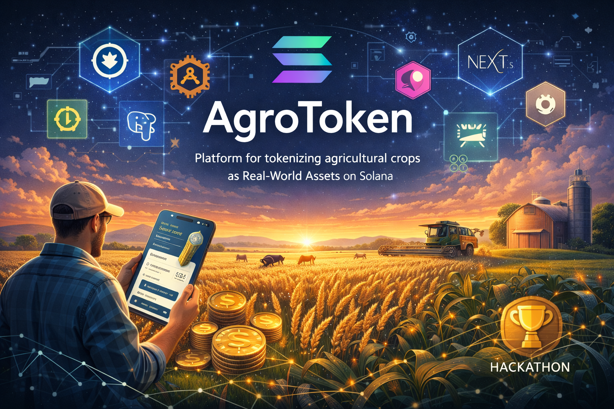

# AgroToken


> AgroToken — это платформа на базе Solana для токенизации будущего сельскохозяйственного урожая как реального актива (`RWA`). Фермеры создают кампании, подтверждённые off-chain доказательствами, инвесторы покупают дробные доли урожая, а после продажи урожая выручка распределяется прозрачно on-chain.
>
> Проект разрабатывается для `National Solana Hackathon by Decentrathon`, `Кейс 1: Tokenization of Real-World Assets (RWA)`.




---

## Содержание

- [Документация и материалы](#документация-и-материалы)
- [Команда](#команда)
- [Проблема](#проблема)
- [Решение](#решение)
- [Почему Solana](#почему-solana)
- [Основной пользовательский сценарий](#основной-пользовательский-сценарий)
- [AI Risk Scoring](#ai-risk-scoring)
- [Архитектура](#архитектура)
- [Структура репозитория](#структура-репозитория)
- [Технологический стек](#технологический-стек)
- [Текущее состояние проекта](#текущее-состояние-проекта)
- [Локальный запуск](#локальный-запуск)
- [Важные замечания по окружению](#важные-замечания-по-окружению)
- [Что должно быть видно в демо](#что-должно-быть-видно-в-демо)
- [Чеклист перед сдачей](#чеклист-перед-сдачей)
- [Позиционирование проекта](#позиционирование-проекта)

---

## Документация и материалы

- [docs/](docs/) — текстовая документация проекта
- [docs/roadmap.md](docs/roadmap.md) — технический roadmap реализации
- [docs/feature-roadmap.md](docs/feature-roadmap.md) — продуктовый roadmap и demo-фичи
- [assets/screenshots/](assets/screenshots/) — скриншоты интерфейса
- [assets/gifs/](assets/gifs/) — GIF и короткие demo-анимации
- [assets/diagrams/](assets/diagrams/) — схемы, архитектурные диаграммы и визуальные материалы

---

## Команда

| Участник | Роль | Контакты |
| --- | --- | --- |
| Бишимбай Бекарыс | капитан и основатель | `bekars.bihimbai2005@gmail.com` |
| Жексенбаев Арслан | основатель и разработчик | `arslan.zheksenbayev@mail.ru` |
| Абаев Баязит | основатель и разработчик | `bayazit439@gmail.com` |
| Тажибаев Марсель | основатель и мотиватор | `Bentenm22@gmail.com` |

---

## Проблема

Фермерам в Казахстане часто нужен оборотный капитал ещё до сбора урожая, а розничные инвесторы почти не имеют доступа к прозрачным инвестициям в реальный сектор.

У традиционного аграрного финансирования есть несколько проблем:

- высокий порог входа для инвесторов
- слабая прозрачность владения и выплат
- низкий уровень доверия к посредникам
- ограниченная цифровая доступность
- ручное и непрозрачное распределение доходов

AgroToken решает эту проблему, превращая будущий урожай в программируемые on-chain доли, подтверждённые off-chain доказательствами и oracle-подтверждением.

---

## Решение

Каждая кампания представляет собой раунд финансирования будущего урожая.

- фермер создаёт кампанию под будущий урожай
- off-chain документы и доказательства хэшируются и связываются с on-chain состоянием кампании
- инвесторы покупают дробные доли за mock USDC в devnet
- владение долями представлено через SPL-токены
- после подтверждения продажи урожая выручка распределяется пропорционально между держателями токенов

---

## Почему Solana

Solana используется как основной слой расчётов и владения, а не как формальная интеграция кошелька.

- `Anchor` program описывает жизненный цикл кампании и логику выплат
- `SPL Token` mint представляет дробное владение урожаем
- `PDA`-аккаунты используются для детерминированного управления кампанией, mint и vault
- `Phantom` используется для подписи пользовательских транзакций
- on-chain состояние должно быть источником истины для владения и статуса кампании

---

## Основной пользовательский сценарий

1. Фермер подключает кошелёк
2. Фермер создаёт кампанию под будущий урожай
3. Метаданные и хэш доказательства сохраняются и связываются с кампанией
4. Инвесторы просматривают маркетплейс и покупают доли урожая
5. Инвестор получает токены долей на свой кошелёк
6. Oracle или фермер подтверждает факт продажи урожая
7. Выручка распределяется on-chain между держателями токенов
8. Кампания завершается

---

## AI Risk Scoring

Каждая кампания автоматически оценивается AI-моделью при создании. Инвестор видит оценку риска от 1 до 100 и объяснение прямо на карточке кампании.

Параметры оценки:

- тип культуры и её волатильность
- регион и климатическая надёжность
- время до сбора урожая
- объём запрашиваемого финансирования
- история фермера (количество предыдущих кампаний)

Технически: backend отправляет параметры кампании в Ollama (локальная LLM `llama3.2`), получает JSON с числовым скором и текстовым объяснением на русском языке. Результат сохраняется в PostgreSQL и отображается на фронтенде как цветной бейдж (Low / Medium / High Risk).

Если Ollama недоступна, создание кампании не блокируется — скоринг просто пропускается. Пересчёт доступен через `POST /api/campaigns/{id}/rescore`.

---

## Архитектура

| Слой | Директория | Ответственность |
| --- | --- | --- |
| Смарт-контракт | `programs/agrotoken` | создание состояния кампании; создание детерминированного SPL mint и USDC vault; продажа дробных долей урожая; подтверждение продажи урожая; распределение выручки между держателями; завершение жизненного цикла токенов |
| Backend | `backend` | API для кампаний и инвестиций; хранение метаданных в PostgreSQL; построение и оркестрация Solana-транзакций; поддержка proof-of-asset; read-model для фронтенд-дашбордов |
| Frontend | `frontend` | UI маркетплейса; кабинет фермера; кабинет инвестора; страница кампании и сценарий покупки; интеграция кошелька через Phantom |

---

## Структура репозитория

```text
programs/agrotoken   Смарт-контракт на Anchor
backend              REST API на Spring Boot
frontend             Веб-приложение на Next.js
tests                Набор Anchor-тестов
migrations           Скрипты деплоя Anchor
docker-compose.yml   Конфигурация PostgreSQL, Ollama, Backend
Anchor.toml          Конфигурация Anchor workspace
docs/                Текстовая документация и roadmap-файлы
```

---

## Технологический стек

| Категория | Технологии |
| --- | --- |
| Blockchain | Solana `devnet`, Anchor `Rust`, SPL Token |
| Backend | Java 21, Spring Boot 3, PostgreSQL |
| Frontend | Next.js 14, TypeScript, Tailwind CSS, Phantom wallet adapter |
| AI | Ollama + llama3.2 (AI Risk Scoring) |

---

## Текущее состояние проекта

В репозитории уже присутствует полный каркас продукта:

- структура Anchor program
- структура backend API
- frontend маркетплейс и дашборды
- базовая интеграция кошелька

Проект всё ещё доводится до состояния полноценного submission-grade MVP. Основные оставшиеся задачи:

- завершить реальный on-chain flow end-to-end
- заменить backend-заглушки транзакций на реальную Solana-интеграцию
- дописать Anchor-тесты
- завершить UX для proof-of-asset
- стабилизировать demo flow на devnet

Актуальный порядок реализации описан в [docs/roadmap.md](/C:/Users/hp/LosPollosHermanos/docs/roadmap.md).

---

## Локальный запуск

### Требования

- Rust toolchain
- Solana CLI
- Anchor CLI
- Node.js 18+
- Java 21
- Docker

### Запуск инфраструктуры (PostgreSQL + Ollama)

```bash
docker compose up -d postgres ollama
docker exec agrotoken-ollama ollama pull llama3.2
```

### Запуск backend

```bash
cd backend
./mvnw spring-boot:run
```

Для Windows PowerShell:

```powershell
cd backend
.\mvnw.cmd spring-boot:run
```

Или всё через Docker (включая backend):

```bash
docker compose up -d --build
```

### Запуск frontend

```bash
cd frontend
npm install
npm run dev
```

### Запуск Anchor-тестов

```bash
anchor test
```

---

## Важные замечания по окружению

- целевая сеть — `Solana devnet`
- проект использует детерминированные `PDA` seeds
- UI ориентирован на рынок Казахстана
- продукт нельзя считать завершённым, пока основной сценарий не демонстрируется как реально работающий on-chain

---

## Что должно быть видно в демо

Демо должно показывать:

- создание кампании
- AI Risk Score на карточке кампании
- покупку токенов
- on-chain владение
- связь между proof и активом
- распределение выручки
- реальное использование Solana как слоя расчётов

---

## Чеклист перед сдачей

- задеплоенный Solana program
- рабочий end-to-end demo flow на devnet
- понятный README
- краткое описание архитектуры
- скриншоты или demo video
- GitHub-репозиторий
- submission на `colosseum.com`

---

## Позиционирование проекта

> AgroToken — это не просто интерфейс для краудфандинга. Это программируемый слой владения и распределения дохода для сельскохозяйственных real-world assets, адаптированный под рынок Казахстана и построенный на Solana.
